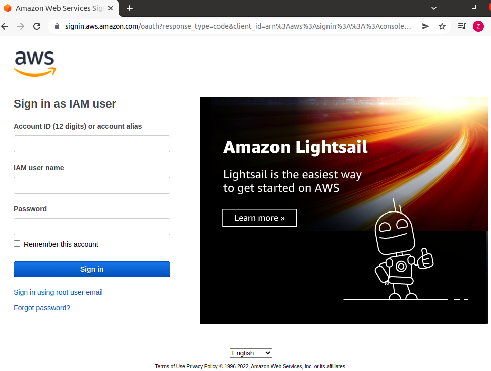
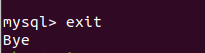
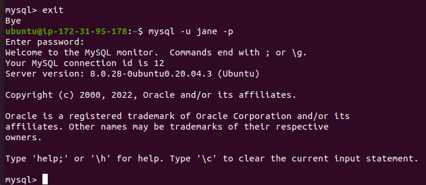

# Project2WebStack

### LEMP STACK Implementation on AWS
 
Web stack comprises a bundle of software and frameworks used for building full-stack web apps. All stacks generally consist of an operating system, a database, a web server and server-side & client-side technologies. There are different web stacks, but this guide will demonstrate the installation of the LEMP stack using AWS service. 

 
**L** - *Linux* 

**E** - *Nginx* 

**M** - *MySQL*

**P** - *PHP*

LEMP is a collection of open-source software that communicate with each other in order to create a fully functional dynamic web application. It is highly stable, flexible in customization and has a strong community support. 

## Prerequisite 

You need to signup or sign-in to your AWS account. This will be used to provision an instance on AWS and begin our process. 

 
## Step 1 - Linux (Installing Linus by provisioning an instance on AWS)

*Linux is a free and open-source Unix operating system known to be less vulnerable to malware and viruses. Two of the most commonly used Linux distributions are Debian and Ubuntu. For this stack, we will use* ***Ubuntu.*** 

As soon as you sign in, the first screen is the management console. This shows recently utilized AWS services.
 

 
At any point in your account, you can determine the user signed in and the region by looking at the top right corner
 

 
Using the search bar at the top, type *EC2* and select from the options displayed EC2 to get to the instance page where you will provision an instance.
 

 
On the instances page, click *Launch instances*. 
 

 
On the Amazon Machine Image page, select *Ubuntu Server 20.01 LTS (HVM), SSD Volume Type*.
 

 
On the Instance Type page, select *t2.micro* and click *Review and Launch*
 

 
Launch your instance. You will be asked to create a new key pair or choose an existing one
 
**Note: Keep your key-pair safe because it is needed to access your instance from your command line**.
 

 
Next step is to link your instance to your local machine by running
 
    ssh -i <Your-private-key.pem> ubuntu@<EC2-Public-IP-address>
 
Your public IP address can be found in your instance details. 
 

 
To avoid getting the error *Bad permissions* change the permission for your private key in your terminal using `chmod`. 

*Chmod is the command used to change the access permission of file system objects. It allows you to control exactly who is able to read, edit or run your file*. 

    $ sudo chmod 0400 project2.pem
 

 

## Step 2 - Installing Nginx Web Server

*Nginx, pronounced as ‘Engine-x’  is the second most widely used web server after Apache. It supports all Unix-like systems and partially supports windows. It is compatible with commonly-used applications and fast for serving static files.* 

*Requests made by web browsers are handled by the web server, which in turns passes the request to the server-side technology in this case PHP to communicate with the server and database*. 

 
This is the first time using `apt` in this session so it is advisable to update your server's package index:

    $ sudo apt update
 
Once the update is completed, install the web server:
 
    $ sudo apt install nginx
 

 
When prompted, enter `Y` to confirm your installation.
 
To verify your installation was successful and it is running on your local machine, run:
 
    $ sudo systemctl status nginx
 

 
If ***active*** is green, everything is running properly. You have officially launched your first web server.
 
To allow traffic through the web server, TCP port `80` needs to be open to allow inbound connection on our instance. To achieve this, a security inbound rule needs to be added.
 
On your instance, go to the security group tab; click on the security group to edit the rules.

 
 
Next, click *edit inbound rules* and on the rule page click *Add rule*. 
 

 
Select type *HTTP* which automatically populates to port 80. Source should be anywhere (0.0.0.0/0), which simply means you can access the server from any IP address.  Save the rule.
 

 
 
Once the above steps have been completed,you need to confirm access locally and through your web browser.
 
**Test Locally**
 
To confirm access locally, we use the `curl` command in our local terminal:
 
    $ curl http://localhost:80
 
or
 
    $ curl http://127.0.0.1:80
 
Both commands request Nginx on port 80. The first command uses the DNS name for the local host while the second command uses the IP address of the local host.
 
 
 
**Test on Browser**
 
Using a browser of your choice, paste your instance public Ip address linked to port 80 in the address bar to verify access.
 

> example: "http://3.86.142.95:80"
 

A **"welcome to Nginx"** should display if successful. 
 

 

 
## Step 3 - Installing MySQL

MySQL is an open source relational database used to store and manipulate data. 
 
 
Using the `sudo apt install` command, commence the installation of MySQL and when prompted enter `Y` and click the `ENTER` key.
 
    $ sudo apt install mysql-server 

The database software is now installed, it is recommended to run a security script to remove insecure default settings and lock down access to your database system. Initiate the script with the command:

    $ sudo mysql_secure_installation
 
The script will ask if you want to configure a "VALIDATE PASSWORD PLUGIN". This feature is used to test passwords and improve security but it is not mandatory. Recommend leaving it disabled.
 
>**Warning:**
>
>This feature is sensitive and if enabled, password must meet a specific >criteria.
>
>There are three levels of validation policy and must meet certain >criteria:
>
> 0 = LOW {length >= 8,}
>
> 1 = MEDIUM {length >=8, numeric, mixed case and special characters}
>
>2 = STRONG {length >=8, numeric, mixed case, special characters and dictionary file}
 
Regardless of the validation plugin, you would be asked to set a password for the root user (this is the database root user and not the system root user)
 
>**Always use a strong password** 
 

For the rest of the setup, press `Y` and the `ENTER` key after each prompt when asked to disallow root login remotely, remove anonymous users, remove test database & access to it, and reload privilege table.
 
 

 
 
To test your database and ensure that you can log in, run the command:
 
    $ sudo mysql
 
>Output:
> 
>
 
To exit your database, type `exit` and press `ENTER`. 
 
 
 
The next and final installation of our web stack is PHP. 

## Step 4 - Installing PHP 

*PHP is a scripting language that stands for Hypertext Preprocessor. It works on the server-side and communicates with the database to handle user requests. It is open-source, has more database connectivity and a large community support.* 
 
 
For PHP and Nginx to communicate, an external program is required as a bridge. You will need to install `php-fpm` which stands for PHP fastCGI process manager as well as `php-mysql` a module that allows PHP to communicate with the database backend. 

The core PHP packages will automatically be installed as dependencies and both packages can be installed at once. 

Do this by typing the following: 
 
    $ sudo apt install php-fpm php-mysql
 
Your PHP is successfully installed.
 
 
## Step 5 - Configuring Nginx to use PHP processor
 
In order to tell Nginx to use a PHP processor for dynamic content, a few server block configurations are required. In this guide, we will use ***projectLEMP*** as our domain name: 
 
    $ sudo mkdir /var/www/projectLEMP
 
By creating a new server block rather than editing the default, you can restore to default if the need arises. 

Next assign ownership using the `$USER` variable and the below command:
 
 
    $ sudo chown -R $USER:$USER /var/www/projectLEMP
 
Then open a new file for your configuration. If you prefer to use the vim editor, replace `nano` in the below command with `vim`.
 
    $ sudo nano etc/nginx/sites-available/projectLEMP
 
Paste the below content:
 
>#/etc/nginx/sites-available/projectLEMP
>
>server {
>    
>  listen 80;
>  server_name projectLEMP www.projectLEMP;
>
>  root /var/www/projectLEMP;
>
> index index.html index.htm index.php;
>
> location / {
>
>  try_files $uri $uri/ =404;
>
> }
>
>   location ~ \.php$ {
>
>    include snippets/fastcgi-php.conf;
>
>    fastcgi_pass unix:/var/run/php/php7.4-fpm.sock;
>
>   }
>
> location ~ /\.ht {
>
> deny all;
>
>}  
>
>}
 
Save and close the file using `CTRL + X`, press `Y` and then `ENTER` for the nano editor. 
 
Activate your configuration by linking the config file from Nginx’s site-enabled directory:
 
    $ sudo ln -s /etc/nginx/sites-available/projectLEMP /etc/nginx/sites-enabled/
 
Test your new configuration file for syntax errors:
 
    $ sudo nginx -t

 >output :
 >
 >
 
Unlink the default nginx host that is currently configured: 
 
    $ sudo unlink /etc/nginx/sites-enabled/default
 
Reload Nginx to apply the changes:
 
    $ sudo systemctl reload nginx
 
You have successfully installed and configured your LEMP stack. 
 
Your new website is active, but the web root is empty. You need to create an index.html file in the location to test the server:

    sudo echo 'Hello LEMP from hostname' $(curl -s http://169.254.169.254/latest/meta-data/public-hostname) '3.86.142.95' $(curl -s http://169.254.169.254/latest/meta-data/public-ipv4) > /var/www/projectLEMP/index.html
 
 
 
 
If successful, when you enter your IP address in the browser `http://public IP:80`  you should get the message from your echo **"Hello LEMP from ....."**
 

 
 
## Step 6 - Testing PHP with Nginx

To test that Nginx can correctly send .php files to the processor, you need to first create a PHP file called ***info.php*** in your document root using your text editor. 
 
    nano /var/wwww/projectLEMP/info.php
 
In the editor, paste the below php code:
 
    <?php
    phpinfo();
 

 
Save and exit the editor
 
You can now access this page on your web browser by visiting `http://public IP address/info.php` (example - http://3.86.142.95/info.php). You should be directed to a php page. 
 

 
After verification, it is advisable to remove the php file as it contains sensitive information about your PHP environment. To do this, simply run:
 
    sudo rm /var/www/projectLEMP/info.php
 

## Step 7 - Retrieving  data from MySQL with PHP
 
 You will create a database and configure access to it so that the Nginx website can query the data and display it. 

First, connect to the root account of MySQL in the terminal using:

    $ sudo mysql
 
To create a new database run the command:

    CREATE DATABASE list_database;
 

 
Now create a new user and give the user a password: 
 
    CREATE USER 'jane'@'%' IDENTIFIED WITH mysql_native_password BY 'Accountant2021';
 
Next step is to give the user permission to the list_database
 
    GRANT ALL ON list_database.* TO 'jane'@'%';
 
This gives the user full access to only the list database.
 
To confirm that user has been created, log out of mysql and log in as the user using:
 
    mysql -u jane -p
 

 
To confirm user's access to database, run: 
 
    SHOW DATABASES;
 
>output :
>
>
 
 
Next, create a table in the database:
 
    CREATE TABLE list_database.todo_list (
    mysql>     item_id INT AUTO_INCREMENT,
    mysql>     content VARCHAR(255),
    mysql>     PRIMARY KEY(item_id)
    mysql> );
 
To insert contents into your table,
 
    INSERT INTO list_database.todo_list (content)
    VALUES ('Clean the house'),
           ('Grocery shopping'),
           ('Complete Project 2'),
           ('Meal Prep');
 

 
To verify the data is in your table:
 
    SELECT * FROM list_database.todo_list;
 
A table with your todo list should be produced
 

 
Exit your database:

    mysql> exit
 
The next step is to create a PHP script that will connect to MySQL and query the content. The file can be created using any editor. We will use nano: 
 
    nano /var/www/projectLEMP/todo_list.php
 
Copy the below script in the php file created. Don't forget to change the information where necessary.

    <?php
    $user = "jane";
    $password = "Accountant2021";
    $database = "list_database";
    $table = "todo_list";
    
    try {
    $db = new PDO("mysql:host=localhost;dbname=$database", $user, $password);
    echo "<h2>TODO</h2><ol>";
    foreach($db->query("SELECT content FROM $table") as $row) {
    echo "<li>" . $row['content'] . "</li>";
    }
    echo "</ol>";
    } catch (PDOException $e) {
    print "Error!: " . $e->getMessage() . " ";
    die();
    }
    

 
Save and close the file. 
 
To access/display your to do list from your browser, visit:
 
`http://IP address/todo_list.php`
 

 
Your PHP environment is connected and interacts with your MySQL server. 
 
### YOU HAVE SUCESSFULLY COMPLETED THE PROJECT!!!

